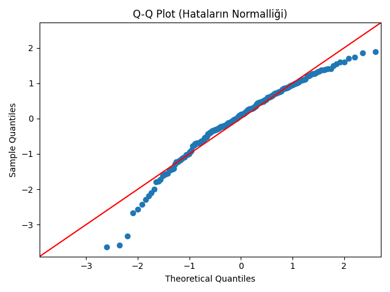

# Multivariate Analysis of Global Development: A Clustering & Regression Approach


## 🇹🇷 Proje Özeti (Turkish)

Bu proje, Dünya Bankası'nın (World Bank) sağladığı **World Development Indicators (WDI)** veri seti üzerinde gerçekleştirilen kapsamlı bir **Veri Analizi** ve **İstatistiksel Modelleme** çalışmasıdır.

Projenin temel amacı; ülkeleri yalnızca GSYİH (GDP) gibi tek boyutlu metriklerle değil; eğitim, sağlık, altyapı ve teknoloji adaptasyonu gibi çok boyutlu göstergelerle analiz etmektir. Çalışma iki ana fazdan oluşmaktadır:
1.  **Unsupervised Learning (Kümeleme):** Gizli kalmış kalkınma kümelerini (Clusters) ortaya çıkarmak.
2.  **Supervised Learning (Regresyon):** Yaşam beklentisini (Life Expectancy) etkileyen faktörlerin istatistiksel önemini ve etki katsayılarını belirlemek.

---

## ⚙️ Metodoloji ve İstatistiksel Yaklaşım

Analiz sürecinde veri bütünlüğünü korumak ve istatistiksel varsayımları sağlamak adına aşağıdaki pipeline izlenmiştir:

### 1. Data Wrangling & Preprocessing
* **Smoothing:** Yıllık dalgalanmaların (Noise) etkisini azaltmak için 10 yıllık periyodun ortalaması alınarak veri stabilize edildi.
* **Imputation Strategy:** Veri setindeki eksik değerler (Missing Values) için `dropna()` yapmak yerine, örneklem kaybını (Sample Loss) ve "Selection Bias"ı önlemek amacıyla **Regional Median Imputation** tekniği uygulandı.
* **Outlier Detection:** Değişkenlerin dağılımları Boxplot analizleri ile incelendi.

### 2. Dimensionality Reduction (PCA) - *Faz 1*
* **Multicollinearity Check:** Yapılan korelasyon analizinde, *Internet Usage* ve *Electricity Access* arasında yüksek korelasyon tespit edildi.
* Modelin "Overfitting" riskini azaltmak ve çoklu bağlantı sorununu çözmek için **Principal Component Analysis (PCA)** uygulandı.
* **Sonuç:** 6 boyutlu uzay, toplam varyansın **%83.60**'ını açıklayan 2 ana bileşene (Principal Components) indirgendi.

### 3. K-Means Clustering - *Faz 1*
* Veriler, ölçek farklarından (Örn: GSYİH binlerce dolar iken, Yaşam Süresi 0-100 arası) etkilenmemesi için **StandardScaler** (Z-Score Normalization) ile normalize edildi.
* Ülkeleri segmentlere ayırmak için **K-Means** algoritması kullanıldı ve `k=3` optimum küme sayısı olarak belirlendi.

### 4. Regression Analysis & Diagnostics - *Faz 2*
Yaşam süresini etkileyen faktörleri açıklamak için **Çoklu Doğrusal Regresyon (Multiple Linear Regression - OLS)** modeli kuruldu.

* **Neden OLS?** Katsayıların yorumlanabilirliğini sağlar.
* **Model Spesifikasyonu:** GSYİH (GDP) değişkeni sağa çarpık (Right-Skewed) olduğu için **Log-Transformation** uygulanmıştır.
    * *Yorumlama:* Log-GDP katsayısı, gelirdeki %1'lik artışın yaşam beklentisinde yarattığı marjinal etkiyi gösterir (Semi-Elasticity).

---

## 📊 Bulgular ve Görselleştirme

### Clustering Results (PCA Projection)
K-Means algoritması sonucunda ülkeler belirgin karakteristiklere sahip 3 ana kümeye ayrıldı:


| Cluster | Avg GDP ($) | Life Expectancy | Electricity (%) | Internet (%) | Interpretation |
| :--- | :--- | :--- | :--- | :--- | :--- |
| **0** | $7,880 | 72.5 | 95.7% | 50.9% | **Developing Economies** (Transition Phase) |
| **1** | $48,791 | 80.4 | 100% | 79.4% | **Advanced Economies** (High Income & Infra) |
| **2** | $1,609 | 61.5 | 44.3% | 15.1% | **Underdeveloped** (Infrastructure Gap) |

### Regression Diagnostics (Q-Q Plot)
Hataların (Residuals) teorik normal dağılım çizgisi (kırmızı) üzerindeki uyumu:



---

## ⚠️ Kısıtlar ve Gelecek Çalışmalar (Future Work)
* **Zaman Boyutu:** Bu çalışma 10 yıllık ortalamalar üzerine kuruludur (Kesitsel Analiz). Gelecek çalışmalarda **Panel Veri Analizi (Panel Data Analysis)** kullanılarak zaman içindeki değişimler de modellenebilir.
* **Nedensellik:** Regresyon analizi korelasyonu gösterir, kesin nedenselliği (Causality) kanıtlamaz. Nedensellik için **Granger Causality** testleri eklenebilir.

---

## 🚀 Kurulum ve Çalıştırma

Projeyi yerel ortamınızda çalıştırmak için:

1.  Repoyu klonlayın:
    ```bash
    git clone [https://github.com/aydin-sena/WDI-Global-Analysis.git](https://github.com/aydin-sena/WDI-Global-Analysis.git)
    ```
2.  Gerekli kütüphaneleri yükleyin:
    ```bash
    pip install -r requirements.txt
    ```
3.  Tüm veri işleme, modelleme ve istatistiksel test sürecini (Pipeline) çalıştırın:
    ```bash
    python src/run_pipeline.py
    ```

---
---

## 🇬🇧 Project Overview (English)

This project is a comprehensive **Data Analysis** and **Statistical Modeling** study based on the **World Development Indicators (WDI)** dataset provided by the World Bank.

The primary objective is to categorize countries into distinct development clusters and statistically analyze the determinants of life expectancy. The project consists of two main phases:
1.  **Unsupervised Learning (Clustering):** Identifying hidden global development patterns.
2.  **Supervised Learning (Regression):** Quantifying the impact of socioeconomic factors on public health outcomes using OLS.

### Methodology

* **Handling Missing Data:** Instead of dropping rows (which causes selection bias), missing values were handled using **Regional Median Imputation** to preserve regional variance.
* **Dimensionality Reduction:** Due to high **Multicollinearity** between development indicators, **Principal Component Analysis (PCA)** was applied, capturing **83.60%** of the total variance with just 2 components.
* **Clustering:** **K-Means Clustering** was performed on **StandardScaled** data to identify 3 distinct global development patterns.

### Regression Analysis & Statistical Diagnostics
To understand the determinants of **Life Expectancy**, a Multiple Linear Regression (OLS) model was built.

* **Why OLS?** Unlike "Black Box" machine learning models, OLS provides interpretable coefficients, allowing us to quantify the impact of each factor.
* **Model Specification:** `Life Expectancy ~ GDP + Schooling + Electricity + Urbanization`
* **Diagnostic Checks:**
    1.  **Multicollinearity:** Checked using **VIF (Variance Inflation Factor)**. Features with VIF > 10 were assessed to prevent unstable coefficients.
    2.  **Normality of Residuals:** Verified via **Q-Q Plots** and **Shapiro-Wilk Test** to ensure hypothesis testing reliability.
    3.  **Homoscedasticity:** Analyzed using *Residuals vs. Fitted* plots to check if error variance is constant.

---

## ⚠️ Limitations & Future Work
* **Temporal Dimension:** This study uses aggregated cross-sectional data. Future iterations could employ **Panel Data Methods** (Fixed/Random Effects) to capture temporal dynamics.
* **Causality:** Regression indicates correlation, not causation. Causal inference techniques (e.g., **Instrumental Variables**) could be applied for deeper insights.

---

### Tech Stack
* **Language:** Python 3.10+
* **Data Manipulation:** Pandas, NumPy
* **Statistical Modeling:** Statsmodels, SciPy
* **Machine Learning:** Scikit-Learn (PCA, K-Means, StandardScaler)
* **Visualization:** Matplotlib, Seaborn
